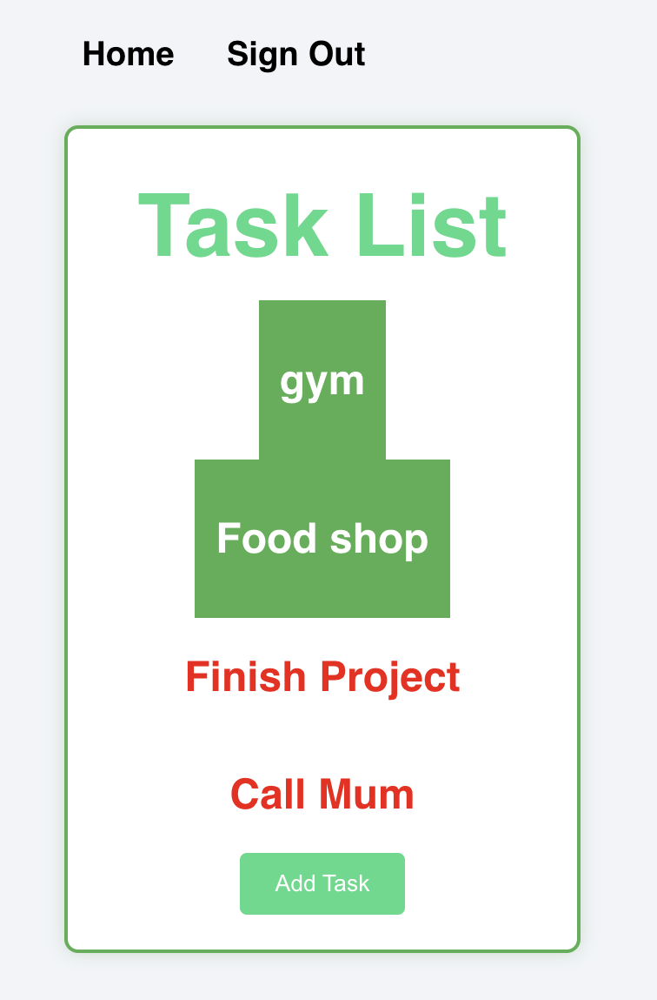

# TickIt: A Task Management App
## TickIt is a task management web application built with React on the front-end, Node.js and Express on the back-end, and MongoDB for data storage. This full-stack application allows users to sign up, sign in, and manage their tasks with full CRUD functionality. The app uses JWT tokens for user authentication and authorization, ensuring that only signed-in users can perform actions like creating, updating, or deleting tasks.

Life can get busy and without keeping track of tasks it can be easy to get overwhelmed, miss deadlines and generally add additional uneccesary stress to our lives. TickIt uses visual feedback to encourage users to get their tasks done and provides a user-friendly interface for adding new things that come along. From shopping lists to bucket lists it can provide that added bit of motivation to get things done sooner rather than later!

 

**Key Features:**

* **User Authentication:** Secure sign-up, sign-in, and sign-out functionality using JWT tokens. Token-based authentication ensures that only logged-in users can access task management features.

* **Task Management:** Full CRUD functionality for managing tasks (Create, Read, Update, and Delete). Tasks can be categorised, assigned due dates and updated with a completion status.

* **Responsive UI:** The app provides a user-friendly interface built with React that is fully responsive on both desktop and mobile devices.

 

**Technologies Used:**

**Front-End:**
* React
* React Router

**Back-End:**
* Node.js
* Express
* MongoDB
* Mongoose

**Authentication:**
* JWT (JSON Web Tokens): For securely authenticating users and managing session state.

 

[**Access TickIt here**](https://tick-it-task-manager.netlify.app/)

 
[The back-end repository can be found here](https://github.com/zoe-woodward/tick-it-app-back-end.git)

 
**Planning materials:**
[Find the initial plan here](https://trello.com/b/aqqM3gap/tick-it)

 

**Future Developments**

Some potential upgrades for future versions include:

* **Personalised User Profiles:** Allow users to update their profile details (name, avatar, password) and send users email reminders for upcoming task deadlines.

* **Advanced Task Management:**
Allow users to set task priority (e.g., Low, Medium, High) and send push notifications or in-app reminders for tasks nearing their due dates.
Allow users to create tasks that repeat on a daily, weekly, or monthly basis.
Provide users with the ability to sort and filter tasks by priority, due date, or category.

* **Analytics & Insights:**
Show users stats such as completion rate, overdue tasks, most active days, etc., to help them analyse productivity.
Send users reports on their task completion and performance over time.

